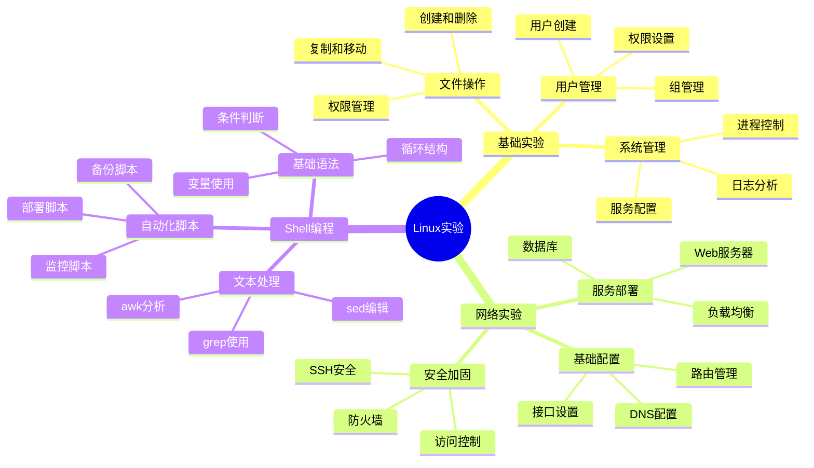
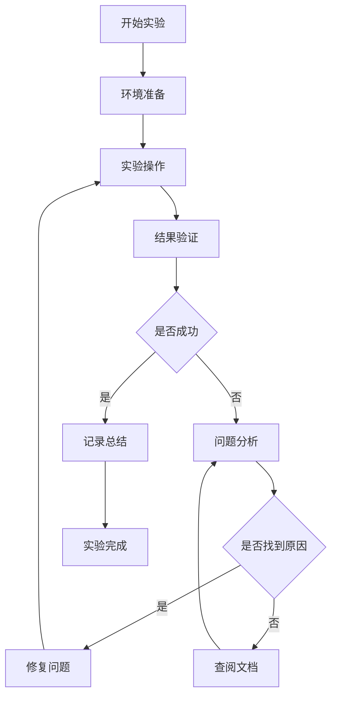

# Linux实验指南 🔬

> 最后更新时间：2025年4月1日
> 
> 版本：1.0.2

## 🗺️ 实验总览思维导图


## 📈 实验流程图


## 📋 目录
- [实验环境检查](#实验环境检查)
- [实验一：文件系统操作](#实验一文件系统操作)
- [实验二：进程管理](#实验二进程管理)
- [实验三：网络配置](#实验三网络配置)
- [实验四：Shell脚本编程](#实验四shell脚本编程)
- [实验五：系统管理](#实验五系统管理)

## ✅ 实验环境检查

### 系统环境检查清单
- [ ] 系统已更新到最新
- [ ] 必要工具已安装完成
- [ ] 网络连接正常工作

### 安全检查清单
- [ ] 重要数据已备份
- [ ] 用户权限已正确设置
- [ ] 防火墙规则已配置

### 工具准备检查清单
- [ ] 编辑器已配置（vim/nano）
- [ ] 版本控制工具已安装（git）
- [ ] 监控工具已准备（top/htop）

## 📝 实验快速参考

### 🔧 常用命令
```bash
# 系统信息
uname -a            # 查看系统信息
df -h              # 查看磁盘使用
free -h            # 查看内存使用

# 进程管理
ps aux             # 查看所有进程
top                # 动态查看进程

# 网络工具
netstat -tunlp     # 查看网络连接
ping google.com    # 测试网络连通性
```

## 目录
- [实验一：文件系统操作](#实验一文件系统操作)
- [实验二：进程管理](#实验二进程管理)
- [实验三：网络配置](#实验三网络配置)
- [实验四：Shell脚本编程](#实验四shell脚本编程)
- [实验五：系统管理](#实验五系统管理)

## 实验一：文件系统操作
### 实验目标
- 掌握Linux文件系统的基本操作
- 理解文件权限管理
- 熟悉文件查找和过滤

### 实验步骤
1. 创建目录结构：
```bash
# 创建实验目录
mkdir -p ~/lab/file_system
cd ~/lab/file_system

# 创建多级目录
mkdir -p docs/{reports,templates}/{2023,2024}

# 创建测试文件
touch docs/reports/2024/report{1..5}.txt
echo "测试内容" > docs/reports/2024/report1.txt
```

2. 文件操作练习：
```bash
# 复制文件
cp docs/reports/2024/report1.txt docs/templates/2024/

# 移动文件
mv docs/reports/2024/report2.txt docs/templates/2024/

# 创建软链接
ln -s docs/reports/2024/report3.txt report_link

# 查找文件
find . -name "report*.txt"
```

3. 权限管理练习：
```bash
# 修改文件权限
chmod 755 docs/reports/2024/report1.txt
chmod u+x docs/reports/2024/report4.txt

# 修改所有者
sudo chown root:root docs/reports/2024/report5.txt

# 查看权限
ls -l docs/reports/2024/
```

### 实验检查点
- [ ] 是否成功创建了多级目录结构？
- [ ] 能否正确执行文件的复制和移动操作？
- [ ] 是否理解了文件权限的含义和修改方法？

## 实验二：进程管理
### 实验目标
- 理解Linux进程的概念
- 掌握进程管理命令
- 学习后台任务管理

### 实验步骤
1. 进程观察：
```bash
# 查看系统进程
ps aux
top

# 查看特定进程
ps aux | grep bash
pgrep bash
```

2. 进程控制：
```bash
# 创建测试脚本
cat > test.sh << 'EOF'
#!/bin/bash
while true; do
    echo "Running..."
    sleep 1
done
EOF

chmod +x test.sh

# 运行和控制进程
./test.sh &          # 后台运行
ps aux | grep test.sh
kill $(pgrep -f test.sh)  # 结束进程
```

3. 后台任务管理：
```bash
# 任务控制
./test.sh
# 按Ctrl+Z暂停
bg                  # 在后台继续运行
jobs                # 查看后台任务
fg                  # 将任务调回前台
```

### 实验检查点
- [ ] 能否使用ps和top查看进程信息？
- [ ] 是否成功创建和控制了测试进程？
- [ ] 掌握了后台任务管理的方法？

## 实验三：网络配置
### 实验目标
- 理解网络配置基础
- 掌握网络诊断工具
- 学习防火墙配置

### 实验步骤
1. 网络信息查看：
```bash
# 查看网络接口
ip addr
ifconfig

# 查看路由表
ip route
route -n
```

2. 网络连接测试：
```bash
# 基本连接测试
ping www.baidu.com
ping -c 4 8.8.8.8

# 路由追踪
traceroute www.baidu.com
mtr www.baidu.com
```

3. 防火墙配置：
```bash
# UFW防火墙
sudo ufw status
sudo ufw enable
sudo ufw allow 80/tcp
sudo ufw allow 22/tcp
```

### 实验检查点
- [ ] 能否查看和理解网络配置信息？
- [ ] 是否成功进行了网络连接测试？
- [ ] 掌握了基本的防火墙配置方法？

## 实验四：Shell脚本编程
### 实验目标
- 掌握Shell脚本基础语法
- 学习文件处理和文本处理
- 实现自动化任务

### 实验步骤
1. 基础脚本编写：
```bash
# 创建第一个脚本
cat > hello.sh << 'EOF'
#!/bin/bash
echo "Hello, $(whoami)!"
echo "Today is $(date)"
echo "System uptime: $(uptime)"
EOF

chmod +x hello.sh
./hello.sh
```

2. 条件和循环：
```bash
# 条件判断脚本
cat > check_file.sh << 'EOF'
#!/bin/bash
file="$1"
if [ -f "$file" ]; then
    echo "文件存在"
    echo "大小: $(du -h "$file" | cut -f1)"
else
    echo "文件不存在"
fi
EOF

chmod +x check_file.sh
```

3. 文本处理：
```bash
# 日志分析脚本
cat > analyze_log.sh << 'EOF'
#!/bin/bash
log_file="$1"
echo "分析文件: $log_file"
echo "行数: $(wc -l < "$log_file")"
echo "错误数: $(grep -c "ERROR" "$log_file")"
echo "警告数: $(grep -c "WARNING" "$log_file")"
EOF

chmod +x analyze_log.sh
```

### 实验检查点
- [ ] 能否编写并运行基本的Shell脚本？
- [ ] 是否理解了条件判断和循环的使用？
- [ ] 掌握了基本的文本处理命令？

## 实验五：系统管理
### 实验目标
- 学习用户和组管理
- 掌握服务管理
- 理解日志系统

### 实验步骤
1. 用户管理：
```bash
# 创建用户和组
sudo groupadd testgroup
sudo useradd -m -g testgroup testuser
sudo passwd testuser

# 修改用户权限
sudo usermod -aG sudo testuser
```

2. 服务管理：
```bash
# 查看系统服务
systemctl list-units --type=service
systemctl status ssh

# 管理服务
sudo systemctl start nginx
sudo systemctl enable nginx
```

3. 日志管理：
```bash
# 查看系统日志
sudo tail -f /var/log/syslog
sudo journalctl -f

# 配置日志轮转
sudo vim /etc/logrotate.d/custom
```

### 实验检查点
- [ ] 是否成功创建和管理了用户？
- [ ] 能否正确管理系统服务？
- [ ] 掌握了日志查看和管理方法？

## 实验总结
完成所有实验后，你应该能够：
1. 熟练操作Linux文件系统
2. 理解并管理Linux进程
3. 配置和诊断网络问题
4. 编写基本的Shell脚本
5. 进行基本的系统管理任务

## 进阶练习
1. 尝试编写一个完整的系统监控脚本
2. 配置一个Web服务器
3. 实现自动化备份方案
4. 搭建开发环境 