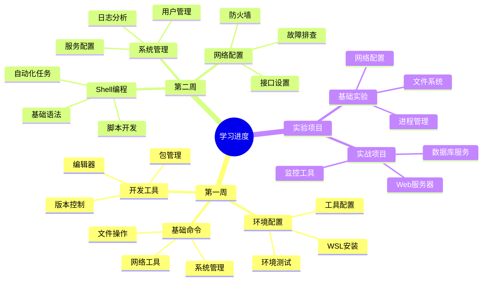
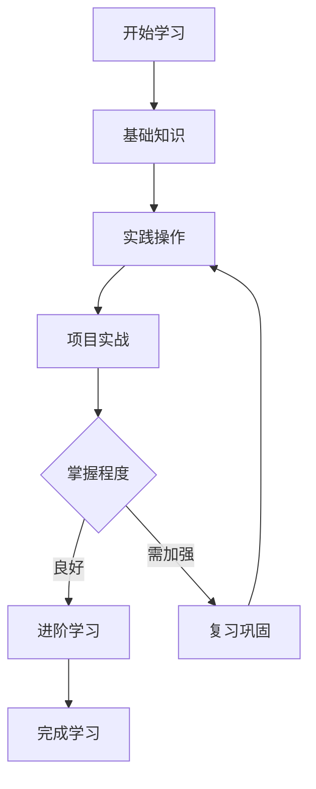

# Linux学习进度跟踪表 📊

> 最后更新时间：2025年4月1日
> 
> 版本：1.0.1
> 
> 说明：
> - [x] 表示已完成 ✅
> - [ ] 表示未完成 ⏳
> - [~] 表示进行中 🔄

## 🗺️ 学习进度思维导图

## 📈 学习路线流程图

## 📋 目录
- [第一周进度](#第一周基础知识和环境搭建)
- [第二周进度](#第二周进阶操作和实践)
- [实验任务进度](#实验任务)
- [实战项目进度](#实战项目)
- [技能掌握进度](#故障排查能力)

## 第一周：基础知识和环境搭建 🚀

### 1. 环境配置 ⚙️
- [x] WSL安装Ubuntu 💻
- [x] 中文环境配置 🌏
- [x] Git配置 📦
- [x] Python环境配置 🐍
- [x] XFCE4图形界面配置 🖥️
- [x] Python虚拟环境配置 🔧

### 2. 基础命令学习 📝
- [ ] 文件系统命令（ls, cd, pwd, mkdir, rm等）📂
- [ ] 文件操作命令（cp, mv, touch等）📄
- [ ] 文本处理命令（cat, less, head, tail等）📑
- [ ] 权限管理命令（chmod, chown等）🔒
- [ ] 进程管理命令（ps, top, kill等）⚙️
- [ ] 网络命令（ping, ifconfig, netstat等）🌐

### 3. 开发工具使用 🛠️
- [ ] Vim编辑器基础操作 ✍️
- [ ] Git基础操作（clone, add, commit, push等）📦
- [ ] 包管理工具使用（apt, pip等）📦

## 第二周：进阶操作和实践

### 1. 系统管理
- [ ] 用户和组管理
- [ ] 服务管理（systemctl）
- [ ] 日志管理
- [ ] 磁盘管理
- [ ] 性能监控

### 2. 网络配置
- [ ] 网络接口配置
- [ ] 防火墙设置
- [ ] SSH远程连接
- [ ] 网络故障排查

### 3. Shell脚本编程
- [ ] 基础语法
- [ ] 条件判断
- [ ] 循环结构
- [ ] 函数定义
- [ ] 文本处理

## 实验任务

### 实验一：文件系统操作
- [ ] 创建项目目录结构
- [ ] 文件操作练习
- [ ] 权限管理练习

### 实验二：进程管理
- [ ] 进程观察和分析
- [ ] 进程控制操作
- [ ] 后台任务管理

### 实验三：网络配置
- [ ] 网络信息查看
- [ ] 连接测试
- [ ] 防火墙配置

### 实验四：Shell脚本编程
- [ ] 编写基础脚本
- [ ] 实现条件和循环
- [ ] 完成文本处理任务

### 实验五：系统管理
- [ ] 用户和组管理
- [ ] 服务配置
- [ ] 日志系统管理

## 实战项目

### 项目一：文件管理系统
- [ ] 项目结构搭建
- [ ] 核心功能实现
- [ ] 测试和优化

### 项目二：系统监控工具
- [ ] 监控脚本编写
- [ ] Web界面开发
- [ ] 告警功能实现

### 项目三：Web服务器部署
- [ ] 安装必要软件
- [ ] 配置Web服务器
- [ ] 部署示例应用

### 项目四：数据库服务器
- [ ] MySQL安装配置
- [ ] 主从复制设置
- [ ] 性能优化

### 项目五：容器化应用
- [ ] Docker环境配置
- [ ] 应用容器化
- [ ] 服务编排

## 故障排查能力

### 系统问题
- [ ] 启动问题排查
- [ ] 性能问题分析
- [ ] 磁盘问题处理

### 网络问题
- [ ] 连接问题排查
- [ ] DNS问题解决
- [ ] 网络性能优化

### 服务问题
- [ ] 服务启动问题
- [ ] 配置错误修复
- [ ] 日志分析能力

### 安全问题
- [ ] 基础安全配置
- [ ] 安全审计
- [ ] 漏洞修复

## 进阶技能

### 持续集成/持续部署
- [ ] 自动化构建
- [ ] 自动化测试
- [ ] 自动化部署

### 高可用架构
- [ ] 服务器集群
- [ ] 负载均衡
- [ ] 故障转移

### 性能优化
- [ ] 系统性能优化
- [ ] 数据库优化
- [ ] 网络性能优化

### 安全加固
- [ ] WAF配置
- [ ] SSL证书配置
- [ ] 安全审计实施

## 学习资源
- [ ] 官方文档阅读
- [ ] 在线教程学习
- [ ] 实践练习完成
- [ ] 问题记录和总结

## 每日任务
- [ ] 命令练习
- [ ] 文档阅读
- [ ] 实验操作
- [ ] 问题记录
- [ ] 知识总结 