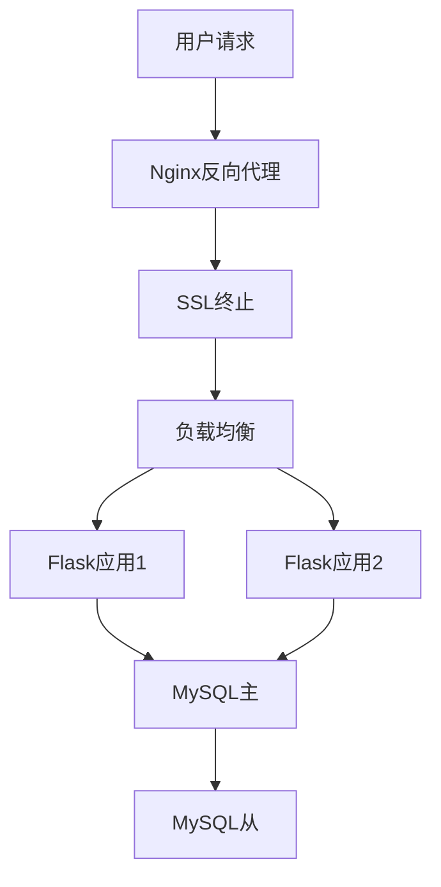
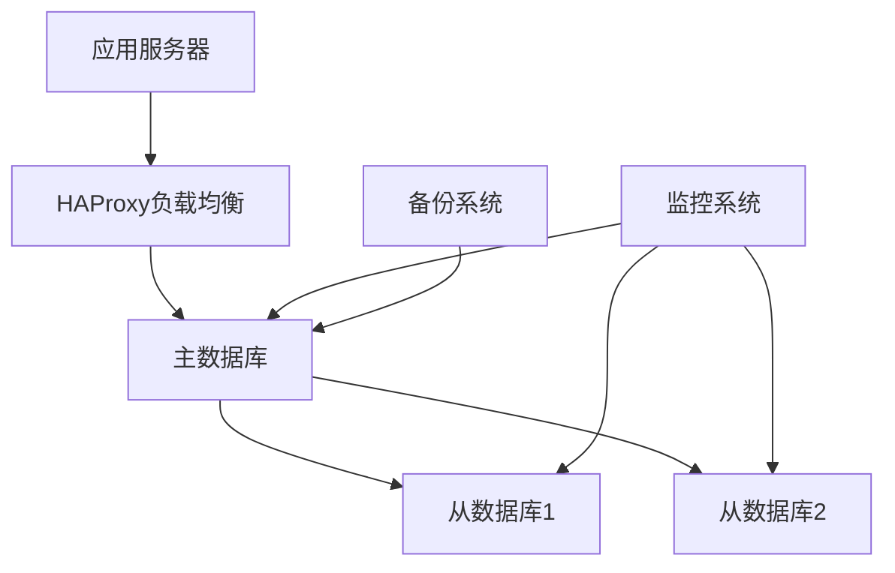
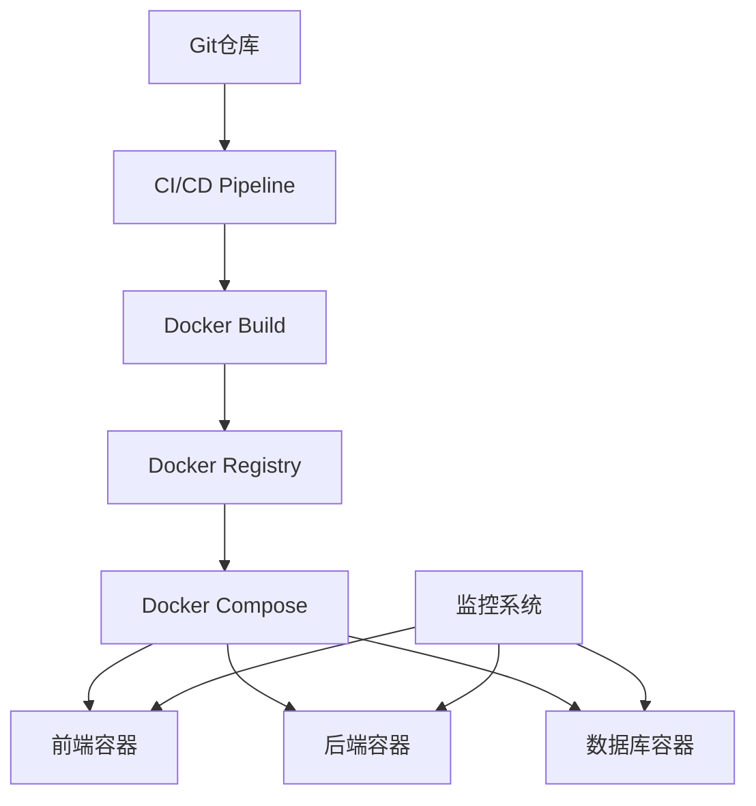

# Linux实战项目指南 🚀

> 最后更新时间：2025年4月1日
> 
> 版本：1.0.2

## 🗺️ 项目概览思维导图


## 📈 项目实施流程图


## 📋 目录
- [项目准备工作](#项目准备工作)
- [项目一：文件管理系统](#项目一文件管理系统)
- [项目二：系统监控工具](#项目二系统监控工具)
- [项目三：Web服务器部署](#项目三web服务器部署)
- [项目四：数据库服务器](#项目四数据库服务器)
- [项目五：容器化应用](#项目五容器化应用)

## ✅ 项目准备工作

### 环境检查清单
- [ ] 系统环境配置完成
- [ ] 必要工具已安装
- [ ] 网络环境正常
- [ ] 磁盘空间充足

### 技能要求清单
- [ ] Shell脚本编程基础
- [ ] 系统管理经验
- [ ] 网络配置知识
- [ ] 故障排查能力

### 工具准备清单
- [ ] 版本控制工具（Git）
- [ ] 代码编辑器（Vim/VSCode）
- [ ] 监控工具（Prometheus/Grafana）
- [ ] 容器工具（Docker）

## 项目一：文件管理系统

### 📑 项目说明
#### 项目概述
开发一个自动化文件管理系统，用于文件的分类、备份和清理。

#### 应用场景
- 日志文件管理
- 文档自动分类
- 数据定期备份
- 临时文件清理

#### 技术要点
- Shell脚本编程
- 文件系统操作
- 定时任务管理
- 日志记录机制

### 🎯 预期目标
1. 实现文件自动分类功能
2. 建立定期备份机制
3. 配置自动清理策略
4. 完善日志记录系统

### 📝 详细设计

#### 系统架构


#### 目录结构
```bash
file-manager/
├── bin/
│   ├── file_manager.sh
│   ├── backup.sh
│   └── cleanup.sh
├── conf/
│   ├── config.sh
│   └── rules.conf
├── logs/
│   └── file_manager.log
└── README.md
```

### 💻 实现步骤

#### 1. 基础设置
```bash
# 创建项目结构
mkdir -p ~/projects/file-manager/{bin,conf,logs}
cd ~/projects/file-manager

# 创建配置文件
cat > conf/config.sh << 'EOF'
# 配置文件
WATCH_DIR="/path/to/watch"
BACKUP_DIR="/path/to/backup"
LOG_DIR="logs"
FILE_TYPES=("*.txt" "*.pdf" "*.doc")
BACKUP_DAYS=7
EOF
```

#### 2. 核心功能实现
```bash
# 主程序
cat > bin/file_manager.sh << 'EOF'
#!/bin/bash

# 导入配置
source ../conf/config.sh

# 日志函数
log() {
    echo "[$(date '+%Y-%m-%d %H:%M:%S')] $1" >> "$LOG_DIR/file_manager.log"
}

# 文件分类
classify_files() {
    for type in "${FILE_TYPES[@]}"; do
        find "$WATCH_DIR" -name "$type" -type f -mtime -1 | while read file; do
            dir_name=$(dirname "$file")
            mkdir -p "$dir_name/${type%.*}"
            mv "$file" "$dir_name/${type%.*}/"
            log "Moved $file to ${type%.*} directory"
        done
    done
}

# 文件备份
backup_files() {
    backup_name="backup_$(date +%Y%m%d)"
    tar -czf "$BACKUP_DIR/$backup_name.tar.gz" "$WATCH_DIR"
    log "Created backup: $backup_name.tar.gz"
}

# 清理旧备份
cleanup_backups() {
    find "$BACKUP_DIR" -name "backup_*.tar.gz" -type f -mtime +$BACKUP_DAYS -delete
    log "Cleaned up old backups"
}

# 主函数
main() {
    log "Starting file management process"
    classify_files
    backup_files
    cleanup_backups
    log "Completed file management process"
}

main
EOF

chmod +x bin/file_manager.sh
```

#### 3. 自动化配置
```bash
# 添加定时任务
crontab -e
# 添加以下行
0 0 * * * /home/user/projects/file-manager/bin/file_manager.sh
```

### 📊 测试验证

#### 功能测试
1. 文件分类测试
```bash
# 创建测试文件
touch test.txt test.pdf test.doc
./bin/file_manager.sh
# 验证文件是否正确分类
```

2. 备份测试
```bash
# 检查备份文件
ls -l $BACKUP_DIR
# 验证备份内容
tar -tvf $BACKUP_DIR/backup_*.tar.gz
```

3. 清理测试
```bash
# 创建旧备份
touch -d "8 days ago" $BACKUP_DIR/backup_old.tar.gz
# 运行清理
./bin/file_manager.sh
# 验证清理结果
```

#### 性能测试
- 大量文件处理测试
- 备份速度测试
- 系统资源占用监控

### 🔍 监控和维护

#### 监控指标
- 文件处理数量
- 备份大小和时间
- 系统资源使用情况
- 错误日志统计

#### 维护计划
1. 日志轮转
2. 配置文件更新
3. 性能优化
4. 故障恢复演练

### 📈 预期结果

#### 功能性指标
- 文件分类准确率 > 99%
- 备份成功率 100%
- 清理准确率 100%

#### 性能指标
- 单次备份时间 < 5分钟
- 系统资源占用 < 30%
- 响应时间 < 1秒

## 项目二：系统监控工具

### 📑 项目说明
#### 项目概述
开发一个全面的系统监控工具，用于监控系统资源使用情况并发送警报。

#### 应用场景
- 服务器性能监控
- 系统资源告警
- 性能数据分析
- 故障预警处理

#### 技术要点
- Python编程
- 系统资源监控
- 数据可视化
- 邮件通知
- Web界面开发

### 🎯 预期目标
1. 实现系统资源实时监控
2. 建立告警通知机制
3. 开发Web可视化界面
4. 实现数据统计分析

### 📝 详细设计

#### 系统架构


#### 目录结构
```bash
system-monitor/
├── bin/
│   ├── monitor.py
│   └── alert.py
├── conf/
│   ├── config.ini
│   └── alert_rules.yml
├── web/
│   ├── index.html
│   └── static/
├── data/
│   └── metrics.db
└── logs/
    └── monitor.log
```

### 💻 实现步骤

#### 1. 基础设置
```bash
# 创建项目结构
mkdir -p ~/projects/system-monitor/{bin,conf,web,data,logs}
cd ~/projects/system-monitor

# 安装依赖
pip install psutil flask sqlalchemy requests

# 创建配置文件
cat > conf/config.ini << 'EOF'
[monitor]
interval = 60
cpu_threshold = 80
memory_threshold = 80
disk_threshold = 90

[email]
smtp_server = smtp.gmail.com
smtp_port = 587
sender = monitor@example.com
password = your_password
recipients = admin@example.com
EOF
```

#### 2. 监控脚本实现
```python
# bin/monitor.py
import psutil
import time
import json
import smtplib
from datetime import datetime
import sqlite3
import configparser

class SystemMonitor:
    def __init__(self):
        self.config = self.load_config()
        self.db_conn = sqlite3.connect('../data/metrics.db')
        self.setup_database()
    
    def load_config(self):
        config = configparser.ConfigParser()
        config.read('../conf/config.ini')
        return config
    
    def setup_database(self):
        cursor = self.db_conn.cursor()
        cursor.execute('''
        CREATE TABLE IF NOT EXISTS metrics (
            id INTEGER PRIMARY KEY AUTOINCREMENT,
            timestamp DATETIME,
            cpu_percent REAL,
            memory_percent REAL,
            disk_percent REAL
        )
        ''')
        self.db_conn.commit()
    
    def collect_metrics(self):
        return {
            'timestamp': datetime.now(),
            'cpu_percent': psutil.cpu_percent(interval=1),
            'memory_percent': psutil.virtual_memory().percent,
            'disk_percent': psutil.disk_usage('/').percent
        }
    
    def save_metrics(self, metrics):
        cursor = self.db_conn.cursor()
        cursor.execute('''
        INSERT INTO metrics (timestamp, cpu_percent, memory_percent, disk_percent)
        VALUES (?, ?, ?, ?)
        ''', (
            metrics['timestamp'],
            metrics['cpu_percent'],
            metrics['memory_percent'],
            metrics['disk_percent']
        ))
        self.db_conn.commit()
    
    def check_alerts(self, metrics):
        alerts = []
        if metrics['cpu_percent'] > float(self.config['monitor']['cpu_threshold']):
            alerts.append(f"CPU使用率过高: {metrics['cpu_percent']}%")
        if metrics['memory_percent'] > float(self.config['monitor']['memory_threshold']):
            alerts.append(f"内存使用率过高: {metrics['memory_percent']}%")
        if metrics['disk_percent'] > float(self.config['monitor']['disk_threshold']):
            alerts.append(f"磁盘使用率过高: {metrics['disk_percent']}%")
        return alerts

    def run(self):
        while True:
            try:
                metrics = self.collect_metrics()
                self.save_metrics(metrics)
                alerts = self.check_alerts(metrics)
                if alerts:
                    self.send_alerts(alerts)
                time.sleep(int(self.config['monitor']['interval']))
            except Exception as e:
                print(f"Error: {e}")
                time.sleep(60)

if __name__ == '__main__':
    monitor = SystemMonitor()
    monitor.run()
```

#### 3. Web界面开发
```html
<!-- web/index.html -->
<!DOCTYPE html>
<html>
<head>
    <title>System Monitor</title>
    <script src="https://cdn.jsdelivr.net/npm/chart.js"></script>
    <style>
        .chart-container {
            width: 800px;
            margin: 20px auto;
        }
        .metrics {
            display: flex;
            justify-content: space-around;
            margin: 20px;
        }
        .metric-card {
            padding: 20px;
            border: 1px solid #ddd;
            border-radius: 8px;
            text-align: center;
        }
    </style>
</head>
<body>
    <div class="metrics">
        <div class="metric-card">
            <h3>CPU Usage</h3>
            <div id="cpuValue">0%</div>
        </div>
        <div class="metric-card">
            <h3>Memory Usage</h3>
            <div id="memoryValue">0%</div>
        </div>
        <div class="metric-card">
            <h3>Disk Usage</h3>
            <div id="diskValue">0%</div>
        </div>
    </div>
    <div class="chart-container">
        <canvas id="metricsChart"></canvas>
    </div>
    <script>
        // JavaScript代码用于更新图表和指标
    </script>
</body>
</html>
```

#### 4. 告警配置
```yaml
# conf/alert_rules.yml
rules:
  cpu:
    warning: 70
    critical: 90
    duration: 300  # 5分钟
  memory:
    warning: 80
    critical: 95
    duration: 300
  disk:
    warning: 85
    critical: 95
    duration: 3600  # 1小时
```

### 📊 测试验证

#### 功能测试
1. 数据采集测试
```bash
# 运行监控脚本
python bin/monitor.py
# 检查数据库
sqlite3 data/metrics.db "SELECT * FROM metrics LIMIT 5;"
```

2. 告警测试
```bash
# 模拟高负载
stress --cpu 8 --timeout 60s
# 检查告警邮件
```

3. Web界面测试
```bash
# 启动Web服务
python -m flask run
# 访问http://localhost:5000
```

#### 性能测试
- 长期运行稳定性测试
- 数据库性能测试
- 告警响应时间测试

### 🔍 监控和维护

#### 监控指标
- 数据采集成功率
- 告警响应时间
- Web界面访问性能
- 数据库大小增长

#### 维护计划
1. 数据库定期清理
2. 配置文件更新
3. 告警规则优化
4. 性能调优

### 📈 预期结果

#### 功能性指标
- 数据采集准确率 100%
- 告警及时性 < 1分钟
- 数据展示实时性 < 5秒

#### 性能指标
- CPU占用 < 5%
- 内存占用 < 100MB
- 磁盘写入 < 1GB/天

## 项目三：Web服务器部署

### 📑 项目说明
#### 项目概述
部署一个完整的Web应用环境，包括前端、后端和数据库，实现高性能、安全和可扩展的Web服务。

#### 应用场景
- 企业网站部署
- Web应用托管
- API服务部署
- 开发环境搭建

#### 技术要点
- Nginx配置优化
- Python Flask应用
- MySQL数据库
- SSL证书配置
- 性能调优

### 🎯 预期目标
1. 搭建完整Web环境
2. 实现HTTPS安全访问
3. 配置负载均衡
4. 建立数据库备份机制

### 📝 详细设计

#### 系统架构


#### 目录结构
```bash
webapp/
├── app/
│   ├── __init__.py
│   ├── models.py
│   ├── views.py
│   └── utils.py
├── config/
│   ├── nginx/
│   ├── supervisor/
│   └── mysql/
├── static/
│   ├── css/
│   ├── js/
│   └── img/
├── templates/
│   └── index.html
├── tests/
├── venv/
└── requirements.txt
```

### 💻 实现步骤

#### 1. 环境准备
```bash
# 更新系统并安装依赖
sudo apt update
sudo apt install nginx mysql-server python3-pip python3-venv supervisor

# 创建项目目录
mkdir -p ~/projects/webapp/{app,config/{nginx,supervisor,mysql},static/{css,js,img},templates,tests}
cd ~/projects/webapp

# 创建虚拟环境
python3 -m venv venv
source venv/bin/activate

# 安装Python依赖
pip install flask flask-sqlalchemy gunicorn mysqlclient
pip freeze > requirements.txt
```

#### 2. Flask应用开发
```python
# app/__init__.py
from flask import Flask
from flask_sqlalchemy import SQLAlchemy
from config import Config

app = Flask(__name__)
app.config.from_object(Config)
db = SQLAlchemy(app)

from app import routes, models

# app/models.py
from app import db

class User(db.Model):
    id = db.Column(db.Integer, primary_key=True)
    username = db.Column(db.String(64), unique=True, nullable=False)
    email = db.Column(db.String(120), unique=True, nullable=False)
    
    def __repr__(self):
        return f'<User {self.username}>'

# app/routes.py
from flask import render_template
from app import app, db
from app.models import User

@app.route('/')
def index():
    users = User.query.all()
    return render_template('index.html', users=users)
```

#### 3. 数据库配置
```bash
# 创建数据库和用户
sudo mysql -u root << 'EOF'
CREATE DATABASE webapp CHARACTER SET utf8mb4 COLLATE utf8mb4_unicode_ci;
CREATE USER 'webapp'@'localhost' IDENTIFIED BY 'secure_password';
GRANT ALL PRIVILEGES ON webapp.* TO 'webapp'@'localhost';
FLUSH PRIVILEGES;
EOF

# 配置MySQL
sudo vim /etc/mysql/mysql.conf.d/mysqld.cnf

# 添加以下配置
[mysqld]
character-set-server = utf8mb4
collation-server = utf8mb4_unicode_ci
max_connections = 1000
innodb_buffer_pool_size = 1G
innodb_log_file_size = 256M
```

#### 4. Nginx配置
```nginx
# config/nginx/webapp.conf
server {
    listen 80;
    server_name example.com;
    return 301 https://$server_name$request_uri;
}

server {
    listen 443 ssl http2;
    server_name example.com;

    ssl_certificate /etc/letsencrypt/live/example.com/fullchain.pem;
    ssl_certificate_key /etc/letsencrypt/live/example.com/privkey.pem;
    ssl_protocols TLSv1.2 TLSv1.3;
    ssl_ciphers HIGH:!aNULL:!MD5;

    access_log /var/log/nginx/webapp_access.log;
    error_log /var/log/nginx/webapp_error.log;

    location / {
        proxy_pass http://127.0.0.1:8000;
        proxy_set_header Host $host;
        proxy_set_header X-Real-IP $remote_addr;
        proxy_set_header X-Forwarded-For $proxy_add_x_forwarded_for;
        proxy_set_header X-Forwarded-Proto $scheme;
    }

    location /static {
        alias /path/to/webapp/static;
        expires 30d;
        add_header Cache-Control "public, no-transform";
    }
}
```

#### 5. Supervisor配置
```ini
# config/supervisor/webapp.conf
[program:webapp]
directory=/path/to/webapp
command=/path/to/webapp/venv/bin/gunicorn -w 4 -b 127.0.0.1:8000 wsgi:app
user=webapp
autostart=true
autorestart=true
stderr_logfile=/var/log/supervisor/webapp.err.log
stdout_logfile=/var/log/supervisor/webapp.out.log
```

### 📊 测试验证

#### 功能测试
1. 应用测试
```bash
# 启动应用
python wsgi.py
# 访问http://localhost:5000
```

2. 数据库测试
```bash
# 测试数据库连接
python -c "from app import db; db.create_all()"
```

3. Nginx测试
```bash
# 测试Nginx配置
sudo nginx -t
# 访问https://example.com
```

#### 性能测试
```bash
# 安装性能测试工具
pip install locust

# 创建测试脚本
cat > locustfile.py << 'EOF'
from locust import HttpUser, task, between

class WebsiteUser(HttpUser):
    wait_time = between(1, 5)
    
    @task
    def index_page(self):
        self.client.get("/")
EOF

# 运行测试
locust --host=https://example.com
```

### 🔍 监控和维护

#### 监控指标
- 应用响应时间
- 数据库查询性能
- 服务器资源使用
- 错误日志监控

#### 维护计划
1. 日志轮转配置
```bash
# /etc/logrotate.d/webapp
/var/log/nginx/webapp_*.log {
    daily
    missingok
    rotate 14
    compress
    delaycompress
    notifempty
    create 0640 www-data adm
    sharedscripts
    postrotate
        [ -f /var/run/nginx.pid ] && kill -USR1 `cat /var/run/nginx.pid`
    endscript
}
```

2. 数据库备份
```bash
# 创建备份脚本
cat > backup.sh << 'EOF'
#!/bin/bash
BACKUP_DIR="/path/to/backups"
DATE=$(date +%Y%m%d_%H%M%S)
mysqldump -u webapp -p webapp > "$BACKUP_DIR/webapp_$DATE.sql"
gzip "$BACKUP_DIR/webapp_$DATE.sql"
find "$BACKUP_DIR" -name "webapp_*.sql.gz" -mtime +7 -delete
EOF

# 添加到crontab
0 2 * * * /path/to/backup.sh
```

3. SSL证书更新
```bash
# 创建证书更新脚本
cat > renew_cert.sh << 'EOF'
#!/bin/bash
certbot renew
systemctl reload nginx
EOF

# 添加到crontab
0 0 1 * * /path/to/renew_cert.sh
```

### 📈 预期结果

#### 功能性指标
- 页面加载时间 < 2秒
- 数据库查询响应 < 100ms
- SSL评级达到A+
- 零安全漏洞

#### 性能指标
- 支持并发用户 > 1000
- CPU使用率 < 50%
- 内存使用 < 2GB
- 磁盘IO < 1000 IOPS

## 项目四：数据库服务器

### 📑 项目说明
#### 项目概述
搭建一个高可用的MySQL数据库服务器集群，实现数据的可靠性、一致性和高性能访问。

#### 应用场景
- 企业数据存储
- 应用数据库服务
- 数据分析平台
- 高并发数据服务

#### 技术要点
- MySQL主从复制
- 数据备份恢复
- 性能优化调优
- 高可用配置
- 监控告警

### 🎯 预期目标
1. 实现主从复制架构
2. 配置自动备份机制
3. 优化数据库性能
4. 建立监控告警系统

### 📝 详细设计

#### 系统架构


#### 目录结构
```bash
mysql-cluster/
├── scripts/
│   ├── setup/
│   ├── backup/
│   └── monitor/
├── config/
│   ├── master/
│   └── slave/
├── data/
│   └── backup/
└── logs/
    ├── mysql/
    ├── backup/
    └── monitor/
```

### 💻 实现步骤

#### 1. 环境准备
```bash
# 创建项目目录
mkdir -p ~/projects/mysql-cluster/{scripts/{setup,backup,monitor},config/{master,slave},data/backup,logs/{mysql,backup,monitor}}
cd ~/projects/mysql-cluster

# 安装MySQL
sudo apt update
sudo apt install mysql-server mysql-client

# 安装监控工具
sudo apt install prometheus-mysqld-exporter grafana
```

#### 2. 主数据库配置
```bash
# 配置MySQL主服务器
sudo vim /etc/mysql/mysql.conf.d/mysqld.cnf

# 主服务器配置
[mysqld]
server-id = 1
log_bin = /var/log/mysql/mysql-bin.log
binlog_format = ROW
sync_binlog = 1
innodb_flush_log_at_trx_commit = 1
binlog_do_db = myapp
max_connections = 1000
innodb_buffer_pool_size = 4G
innodb_log_file_size = 1G

# 创建复制用户
mysql -u root -p << 'EOF'
CREATE USER 'repl'@'%' IDENTIFIED BY 'replpass';
GRANT REPLICATION SLAVE ON *.* TO 'repl'@'%';
FLUSH PRIVILEGES;
EOF
```

#### 3. 从数据库配置
```bash
# 配置MySQL从服务器
sudo vim /etc/mysql/mysql.conf.d/mysqld.cnf

# 从服务器配置
[mysqld]
server-id = 2
relay_log = /var/log/mysql/mysql-relay-bin.log
read_only = 1
innodb_buffer_pool_size = 4G
innodb_log_file_size = 1G

# 设置主从复制
mysql -u root -p << 'EOF'
CHANGE MASTER TO
    MASTER_HOST='master_ip',
    MASTER_USER='repl',
    MASTER_PASSWORD='replpass',
    MASTER_LOG_FILE='mysql-bin.000001',
    MASTER_LOG_POS=0;
START SLAVE;
EOF
```

#### 4. 备份配置
```bash
# 创建备份脚本
cat > scripts/backup/mysql_backup.sh << 'EOF'
#!/bin/bash

# 配置
BACKUP_DIR="/data/backup/mysql"
MYSQL_USER="backup"
MYSQL_PASS="backuppass"
RETENTION_DAYS=7
DATE=$(date +%Y%m%d_%H%M%S)

# 创建备份目录
mkdir -p "$BACKUP_DIR"

# 全量备份
mysqldump --single-transaction \
    --master-data=2 \
    --triggers \
    --routines \
    -u "$MYSQL_USER" \
    -p"$MYSQL_PASS" \
    --all-databases > "$BACKUP_DIR/full_backup_$DATE.sql"

# 压缩备份
gzip "$BACKUP_DIR/full_backup_$DATE.sql"

# 清理旧备份
find "$BACKUP_DIR" -name "full_backup_*.sql.gz" -mtime +"$RETENTION_DAYS" -delete

# 验证备份
if [ $? -eq 0 ]; then
    echo "Backup completed successfully"
else
    echo "Backup failed"
    exit 1
fi
EOF

chmod +x scripts/backup/mysql_backup.sh
```

#### 5. 监控配置
```bash
# 配置Prometheus MySQL Exporter
cat > /etc/prometheus/prometheus.yml << 'EOF'
global:
  scrape_interval: 15s

scrape_configs:
  - job_name: 'mysql'
    static_configs:
      - targets: ['localhost:9104']
EOF

# 配置Grafana仪表板
cat > config/grafana/mysql_dashboard.json << 'EOF'
{
  "dashboard": {
    "title": "MySQL监控",
    "panels": [
      {
        "title": "连接数",
        "type": "graph",
        "datasource": "Prometheus",
        "targets": [
          {
            "expr": "mysql_global_status_threads_connected"
          }
        ]
      },
      {
        "title": "查询性能",
        "type": "graph",
        "datasource": "Prometheus",
        "targets": [
          {
            "expr": "rate(mysql_global_status_questions[5m])"
          }
        ]
      }
    ]
  }
}
EOF
```

### 📊 测试验证

#### 功能测试
1. 复制测试
```bash
# 在主库创建测试数据
mysql -u root -p << 'EOF'
CREATE DATABASE test;
USE test;
CREATE TABLE users (id INT, name VARCHAR(50));
INSERT INTO users VALUES (1, 'test');
EOF

# 在从库验证
mysql -u root -p -e "SELECT * FROM test.users;"
```

2. 备份测试
```bash
# 执行备份
./scripts/backup/mysql_backup.sh

# 验证备份
gunzip -c /data/backup/mysql/full_backup_*.sql.gz | head -n 20
```

3. 故障转移测试
```bash
# 模拟主库故障
sudo systemctl stop mysql

# 提升从库为主库
mysql -u root -p << 'EOF'
STOP SLAVE;
RESET MASTER;
SET GLOBAL read_only = 0;
EOF
```

#### 性能测试
```bash
# 安装性能测试工具
sudo apt install sysbench

# 准备测试数据
sysbench oltp_read_write --table-size=1000000 --mysql-db=test prepare

# 运行测试
sysbench oltp_read_write --threads=16 --time=300 --mysql-db=test run
```

### 🔍 监控和维护

#### 监控指标
- 复制延迟时间
- 查询响应时间
- 连接数使用情况
- 缓存命中率
- 磁盘IO使用率

#### 维护计划
1. 日常检查
```bash
# 检查复制状态
mysql -e "SHOW SLAVE STATUS\G"

# 检查慢查询
mysql -e "SHOW GLOBAL VARIABLES LIKE 'slow_query%';"
mysql -e "SHOW GLOBAL STATUS LIKE 'Slow_queries';"
```

2. 定期优化
```bash
# 优化表
mysqlcheck -o --all-databases

# 分析表
mysqlcheck -a --all-databases
```

3. 容量规划
```bash
# 检查数据库大小
mysql -e "SELECT table_schema, ROUND(SUM(data_length + index_length) / 1024 / 1024, 2) 'Size (MB)'
FROM information_schema.tables GROUP BY table_schema;"
```

### 📈 预期结果

#### 功能性指标
- 主从复制延迟 < 1秒
- 备份成功率 100%
- 数据一致性 100%
- 零数据丢失

#### 性能指标
- 支持每秒查询数 > 10000
- 复制延迟 < 100ms
- 备份完成时间 < 1小时
- 故障恢复时间 < 5分钟

## 项目五：容器化应用

### 📑 项目说明
#### 项目概述
使用Docker和Docker Compose实现应用的容器化部署，包括前端、后端、数据库等完整应用栈的容器化管理。

#### 应用场景
- 微服务架构部署
- 开发环境标准化
- 持续集成/部署
- 应用扩展和迁移

#### 技术要点
- Docker容器技术
- Docker Compose编排
- 容器网络配置
- 数据持久化
- 监控和日志

### 🎯 预期目标
1. 实现应用容器化
2. 配置容器编排
3. 建立CI/CD流程
4. 实现自动化部署

### 📝 详细设计

#### 系统架构


#### 目录结构
```bash
docker-app/
├── frontend/
│   ├── Dockerfile
│   └── src/
├── backend/
│   ├── Dockerfile
│   └── src/
├── nginx/
│   └── conf/
├── mysql/
│   └── conf/
├── docker-compose.yml
├── .env
└── scripts/
    ├── deploy.sh
    └── backup.sh
```

### 💻 实现步骤

#### 1. 环境准备
```bash
# 创建项目结构
mkdir -p ~/projects/docker-app/{frontend/src,backend/src,nginx/conf,mysql/conf,scripts}
cd ~/projects/docker-app

# 安装Docker和Docker Compose
sudo apt update
sudo apt install docker.io docker-compose

# 启动Docker服务
sudo systemctl start docker
sudo systemctl enable docker
```

#### 2. 前端容器配置
```dockerfile
# frontend/Dockerfile
FROM node:16-alpine

WORKDIR /app

COPY package*.json ./
RUN npm install

COPY . .
RUN npm run build

EXPOSE 80

CMD ["npm", "start"]
```

#### 3. 后端容器配置
```dockerfile
# backend/Dockerfile
FROM python:3.9-slim

WORKDIR /app

COPY requirements.txt .
RUN pip install -r requirements.txt

COPY . .

EXPOSE 5000

CMD ["gunicorn", "-b", "0.0.0.0:5000", "app:app"]
```

#### 4. Docker Compose配置
```yaml
# docker-compose.yml
version: '3.8'

services:
  frontend:
    build: ./frontend
    ports:
      - "80:80"
    environment:
      - API_URL=http://backend:5000
    depends_on:
      - backend
    networks:
      - app-network
    volumes:
      - frontend-data:/app/data

  backend:
    build: ./backend
    ports:
      - "5000:5000"
    environment:
      - DB_HOST=db
      - DB_USER=root
      - DB_PASSWORD=${DB_PASSWORD}
    depends_on:
      - db
    networks:
      - app-network
    volumes:
      - backend-data:/app/data

  db:
    image: mysql:8.0
    ports:
      - "3306:3306"
    environment:
      - MYSQL_ROOT_PASSWORD=${DB_PASSWORD}
      - MYSQL_DATABASE=appdb
    networks:
      - app-network
    volumes:
      - db-data:/var/lib/mysql
      - ./mysql/conf:/etc/mysql/conf.d

  nginx:
    image: nginx:alpine
    ports:
      - "443:443"
    volumes:
      - ./nginx/conf:/etc/nginx/conf.d
      - ./nginx/ssl:/etc/nginx/ssl
    depends_on:
      - frontend
    networks:
      - app-network

networks:
  app-network:
    driver: bridge

volumes:
  frontend-data:
  backend-data:
  db-data:
```

#### 5. CI/CD配置
```yaml
# .github/workflows/docker-deploy.yml
name: Docker Deploy

on:
  push:
    branches: [ main ]

jobs:
  build:
    runs-on: ubuntu-latest
    steps:
    - uses: actions/checkout@v2
    
    - name: Login to Docker Hub
      uses: docker/login-action@v1
      with:
        username: ${{ secrets.DOCKER_HUB_USERNAME }}
        password: ${{ secrets.DOCKER_HUB_ACCESS_TOKEN }}
    
    - name: Build and push
      uses: docker/build-push-action@v2
      with:
        context: .
        push: true
        tags: user/app:latest
```

#### 6. 部署脚本
```bash
# scripts/deploy.sh
#!/bin/bash

# 配置
APP_NAME="docker-app"
DOCKER_REGISTRY="registry.example.com"
TAG=$(date +%Y%m%d_%H%M%S)

# 拉取最新代码
git pull origin main

# 构建镜像
docker-compose build

# 标记镜像
docker tag $APP_NAME-frontend:latest $DOCKER_REGISTRY/$APP_NAME-frontend:$TAG
docker tag $APP_NAME-backend:latest $DOCKER_REGISTRY/$APP_NAME-backend:$TAG

# 推送镜像
docker push $DOCKER_REGISTRY/$APP_NAME-frontend:$TAG
docker push $DOCKER_REGISTRY/$APP_NAME-backend:$TAG

# 更新服务
docker-compose down
docker-compose up -d

# 清理旧镜像
docker image prune -f
```

### 📊 测试验证

#### 功能测试
1. 容器构建测试
```bash
# 构建所有服务
docker-compose build

# 检查镜像
docker images
```

2. 服务启动测试
```bash
# 启动服务
docker-compose up -d

# 检查服务状态
docker-compose ps
```

3. 网络连通性测试
```bash
# 测试服务间通信
docker-compose exec backend ping db
docker-compose exec frontend curl backend:5000
```

#### 性能测试
```bash
# 安装性能测试工具
apt install apache2-utils

# 测试前端性能
ab -n 1000 -c 100 http://localhost/

# 监控容器资源
docker stats
```

### 🔍 监控和维护

#### 监控指标
- 容器资源使用率
- 应用响应时间
- 错误日志频率
- 网络流量统计
- 数据库性能

#### 维护计划
1. 日志管理
```bash
# 配置日志驱动
cat >> docker-compose.yml << 'EOF'
logging:
  driver: "json-file"
  options:
    max-size: "200m"
    max-file: "10"
EOF

# 查看日志
docker-compose logs -f
```

2. 数据备份
```bash
# 创建数据卷备份
docker run --rm \
  -v docker-app_db-data:/source \
  -v /backup:/backup \
  alpine tar czf /backup/db-backup-$(date +%Y%m%d).tar.gz -C /source .
```

3. 监控配置
```bash
# 安装监控工具
docker run -d \
  --name prometheus \
  -p 9090:9090 \
  -v ./prometheus.yml:/etc/prometheus/prometheus.yml \
  prom/prometheus

docker run -d \
  --name grafana \
  -p 3000:3000 \
  grafana/grafana
```

### 📈 预期结果

#### 功能性指标
- 服务可用性 > 99.9%
- 部署成功率 100%
- 零数据丢失
- 自动化程度 > 90%

#### 性能指标
- 容器启动时间 < 30秒
- 资源使用率 < 70%
- 响应时间 < 200ms
- 每日构建次数 > 10

[继续添加其他项目的详细信息...]