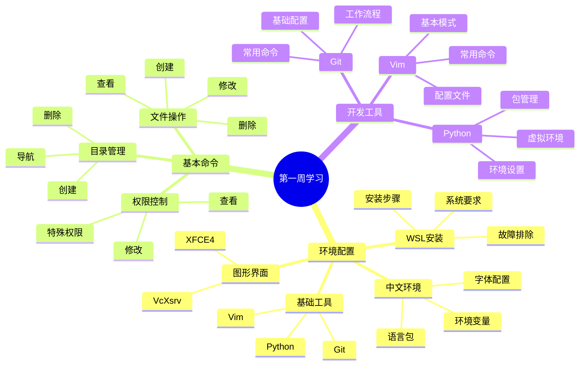
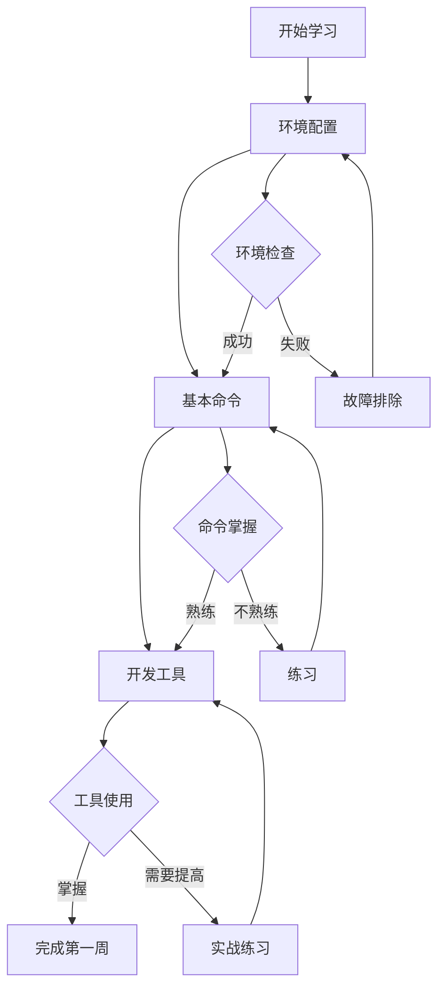
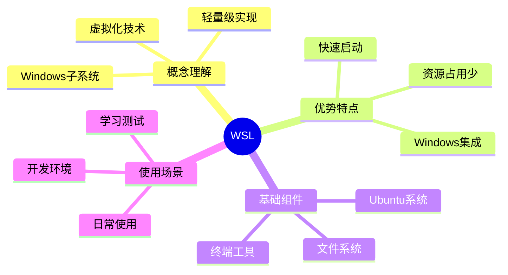
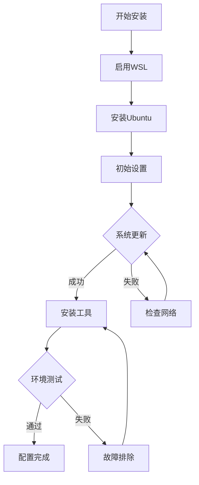
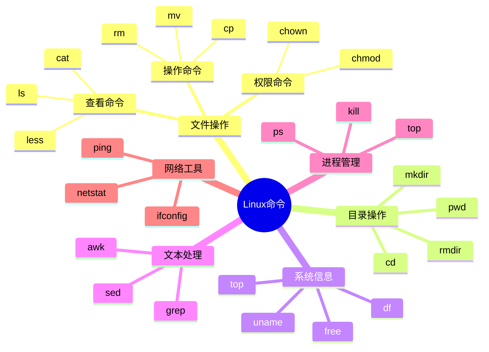
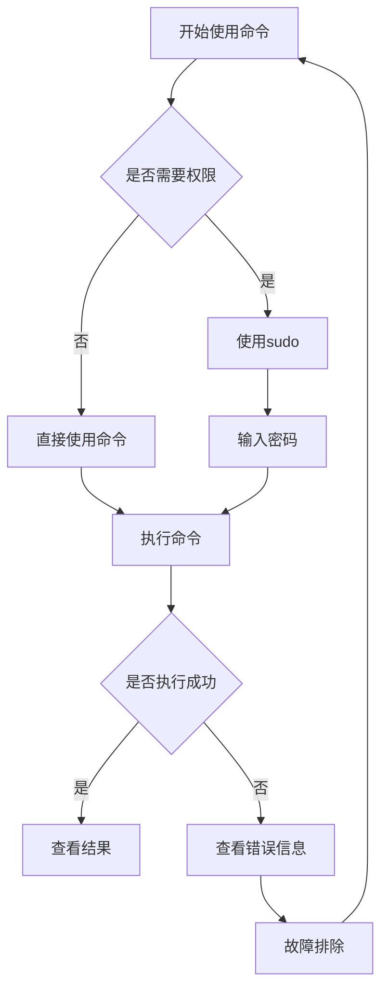
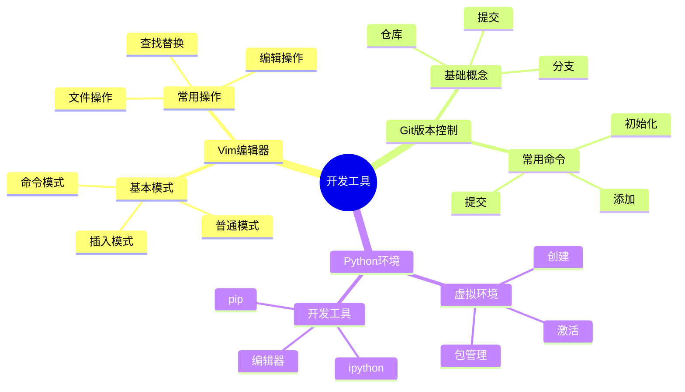
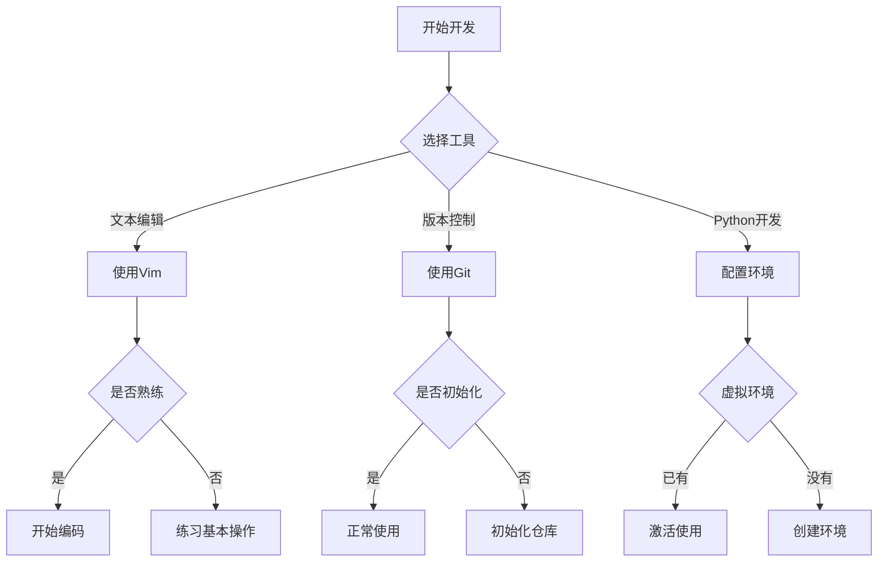

# Linux学习指南 - 第一周：基础知识和环境搭建

> 最后更新时间：2024年3月
> 
> 版本：1.0.2

## 🗺️ 第一周总体思维导图


## 📈 学习路线流程图


## 📋 目录
- [环境配置完成情况](#环境配置完成情况)
- [Day 1-2: 认识Linux和环境搭建](#day-1-2-认识linux和环境搭建)
- [Day 3-4: 基本命令学习](#day-3-4-基本命令学习超详细版)
- [Day 5-7: 文本编辑和开发工具](#day-5-7-文本编辑和开发工具)

## ✅ 环境配置完成情况
### 系统环境检查清单
- [x] WSL已启用
- [x] Ubuntu已安装
- [x] 用户名和密码已设置
  
### 基础配置检查清单
- [x] 系统已更新
- [x] 中文支持已安装
- [x] 时区已设置
  
### 开发工具检查清单
- [x] Git已安装并配置
- [x] Python环境已配置
- [x] Vim已安装
  
### 图形界面检查清单
- [x] XFCE4已安装
- [x] VcXsrv已配置

## Day 1-2: 认识Linux和环境搭建

### 🗺️ WSL概念思维导图


### 📈 环境搭建流程图


### 📝 快速参考卡片

#### 🔧 WSL安装命令
```powershell
# 在Windows PowerShell中（管理员）
wsl --install
wsl --set-default-version 2
```

#### 🌏 中文环境配置
```bash
# 安装中文支持
sudo apt install language-pack-zh-hans -y

# 配置环境变量
echo 'export LANG=zh_CN.UTF-8' >> ~/.bashrc
echo 'export LC_ALL=zh_CN.UTF-8' >> ~/.bashrc
```

#### 🛠️ 基础工具安装
```bash
# 系统更新
sudo apt update
sudo apt upgrade -y

# 开发工具安装
sudo apt install git python3 python3-pip vim -y

# Git配置
git config --global user.name "god-zzq"
git config --global user.email "你的邮箱"
```

### ❓ 常见问题与解决方案

#### 问题1：WSL安装失败
🤔 症状：
- 安装过程报错
- 无法启动Ubuntu

✅ 解决方法：
1. 检查Windows版本（需要Windows 10 2004及以上）
2. 在控制面板启用WSL功能
3. 在BIOS中启用虚拟化
4. 重启电脑后重试

#### 问题2：中文显示异常
🤔 症状：
- 中文显示为方块
- 无法输入中文

✅ 解决方法：
1. 重新安装语言包
2. 检查环境变量设置
3. 安装中文字体
4. 重启终端

## Day 3-4: 基本命令学习（超详细版）

### 🗺️ 命令体系思维导图


### 📈 命令使用流程图


### ✅ 命令掌握检查清单

#### 文件操作命令
- [ ] ls：列出文件和目录
  - [ ] ls -l：详细信息
  - [ ] ls -a：显示隐藏文件
  - [ ] ls -h：人性化显示大小
- [ ] cd：切换目录
  - [ ] cd ..：返回上级
  - [ ] cd ~：返回主目录
- [ ] pwd：显示当前路径
- [ ] mkdir：创建目录
- [ ] rm：删除文件/目录

#### 文件内容操作
- [ ] cat：查看文件内容
- [ ] less：分页查看
- [ ] head：查看文件开头
- [ ] tail：查看文件结尾
- [ ] grep：搜索文本

### 📝 命令快速参考卡片

#### 🗂️ 文件操作速查表
```bash
# 文件列表
ls              # 列出文件
ls -l           # 详细信息
ls -a           # 显示隐藏文件
ls -lh          # 人性化显示大小

# 目录操作
pwd             # 当前位置
cd 目录名        # 切换目录
cd ..           # 上级目录
cd ~            # 主目录
mkdir 目录名     # 创建目录
rmdir 目录名     # 删除空目录

# 文件操作
touch 文件名     # 创建空文件
cp 源文件 目标    # 复制文件
mv 源文件 目标    # 移动/重命名
rm 文件名        # 删除文件
rm -r 目录名     # 删除目录
```

### 1. 理解文件系统
想象你在整理一个超大的书柜（这就是Linux文件系统）：

#### 实际场景对比
| Windows | Linux | 实际例子 |
|---------|-------|----------|
| C盘 | `/` | 书柜的整体 |
| 我的文档 | `/home/用户名` | 你的专属抽屉 |
| 程序文件 | `/usr` | 工具区 |
| Windows目录 | `/etc` | 说明书区 |
| Temp目录 | `/tmp` | 临时工作台 |

#### 新手容易犯的错误
❌ 错误：直接在 `/` 下创建文件
✅ 正确：在自己的 `/home/用户名` 下操作

❌ 错误：修改系统文件没有用sudo
✅ 正确：修改系统文件时使用sudo

### 2. 基础命令实战

#### `ls` - 查看目录内容
就像在查看抽屉里有什么：

```bash
# 最基础的用法
ls
# 输出示例：
Desktop  Documents  Downloads  Pictures

# 查看详细信息（就像查看文件标签）
ls -l
# 输出示例：
drwxr-xr-x 2 god-zzq god-zzq 4096 Mar 25 10:00 Desktop
drwxr-xr-x 2 god-zzq god-zzq 4096 Mar 25 10:00 Documents

# 查看隐藏文件（查看隐藏的东西）
ls -a
# 输出示例：
.  ..  .bashrc  Desktop  Documents  Downloads
```

##### 实际场景
1. 查看下载目录中的文件：
```bash
cd Downloads
ls -l
```

2. 按时间排序查看最近文件：
```bash
ls -lt  # t表示按时间排序
```

3. 查看文件大小（人性化显示）：
```bash
ls -lh  # h表示human readable
# 输出示例：
-rw-r--r-- 1 god-zzq god-zzq 1.2M Mar 25 10:00 图片.jpg
-rw-r--r-- 1 god-zzq god-zzq 2.5G Mar 25 10:00 视频.mp4
```

##### 常见错误和解决
❌ 问题：ls: cannot access '文件名': No such file or directory
✅ 解决：
1. 检查当前位置：pwd
2. 检查文件名大小写
3. 使用tab键自动补全

#### `cd` - 切换目录
就像在书柜的不同抽屉间移动：

```bash
# 基础用法
cd Desktop            # 进入桌面
cd ..                # 返回上一级
cd                   # 回到家目录
cd -                 # 返回上次位置

# 实际例子
cd ~/Desktop         # 无论在哪都能回到桌面
cd ../Downloads      # 返回上级后进入Downloads
```

##### 实际场景
1. 进入项目目录：
```bash
cd ~/projects/my_website
pwd  # 确认位置
```

2. 在目录间快速切换：
```bash
cd ~/Downloads  # 去下载目录
cd -           # 返回项目目录
cd -           # 再次返回下载目录
```

##### 常见错误和解决
❌ 问题：cd: no such file or directory
✅ 解决：
1. 使用pwd查看当前位置
2. 使用ls查看可用目录
3. 使用tab补全路径

#### `mkdir` - 创建目录
就像在书柜里添加新的文件夹：

```bash
# 基础用法
mkdir 文件夹名
mkdir 文件夹1 文件夹2  # 创建多个

# 创建多级目录
mkdir -p a/b/c  # -p表示自动创建父目录
```

##### 实际场景
1. 创建项目结构：
```bash
# 创建一个网站项目结构
mkdir -p my_site/{css,js,images}
tree my_site  # 查看结构
```

2. 创建日期目录：
```bash
# 创建年月日目录
mkdir -p 2024/03/25
```

##### 常见错误和解决
❌ 问题：mkdir: cannot create directory: Permission denied
✅ 解决：
1. 检查目录权限：ls -ld 目录名
2. 在自己的home目录下操作
3. 必要时使用sudo

### 🎯 实战练习：文件管理项目

#### 练习1：创建个人文档库
```bash
# 1. 创建基本结构
mkdir -p ~/Documents/my_library/{books,notes,projects}
cd ~/Documents/my_library

# 2. 在各个目录中创建文件
touch books/book1.txt
echo "这是我的第一个笔记" > notes/note1.txt
mkdir projects/project1

# 3. 查看结构
tree  # 如果没有tree命令，先安装：sudo apt install tree
```

#### 练习2：文件整理
```bash
# 1. 创建临时工作区
mkdir ~/temp_work
cd ~/temp_work

# 2. 创建测试文件
touch file1.txt file2.txt file3.txt
mkdir backup

# 3. 移动和复制文件
cp file1.txt backup/
mv file2.txt backup/
ls -l backup/

# 4. 清理
cd ..
rm -r temp_work  # 删除整个目录
```

### 📝 命令使用小贴士

#### 效率技巧
1. 使用Tab键自动补全
2. 使用方向键↑↓查看历史命令
3. 使用Ctrl+R搜索历史命令
4. 使用通配符：* ? []

#### 路径技巧
- `~` 表示家目录
- `.` 表示当前目录
- `..` 表示上级目录
- `-` 表示上次目录

#### 文件名建议
- 避免使用空格（用下划线或连字符）
- 避免使用特殊字符
- 使用有意义的名称
- 注意大小写

## Day 5-7: 文本编辑和开发工具

### 🗺️ 开发工具思维导图


### 📈 开发工具使用流程图


### ✅ 工具掌握检查清单

#### Vim编辑器
- [ ] 基本操作
  - [ ] 打开文件
  - [ ] 基本编辑
  - [ ] 保存退出
- [ ] 模式切换
  - [ ] 普通模式
  - [ ] 插入模式
  - [ ] 命令模式

#### Git版本控制
- [ ] 基础配置
  - [ ] 用户信息
  - [ ] 默认编辑器
- [ ] 基本操作
  - [ ] 初始化仓库
  - [ ] 添加文件
  - [ ] 提交更改

#### Python环境
- [ ] 虚拟环境
  - [ ] 创建环境
  - [ ] 激活环境
  - [ ] 安装包
- [ ] 开发准备
  - [ ] 编辑器配置
  - [ ] 调试工具
  - [ ] 代码风格

### 📝 工具快速参考卡片

#### 🔧 Vim基本操作
```bash
# 打开文件
vim 文件名

# 常用命令
i        # 进入插入模式
Esc      # 返回普通模式
:w       # 保存
:q       # 退出
:wq      # 保存并退出
:q!      # 强制退出
```

#### 📦 Git基本操作
```bash
# 初始化
git init

# 添加和提交
git add .
git commit -m "提交说明"

# 查看状态
git status
git log
```

#### 🐍 Python环境管理
```bash
# 创建虚拟环境
python3 -m venv myenv

# 激活环境
source myenv/bin/activate

# 包管理
pip install package_name
pip list
```

### ❓ 常见问题与解决方案

#### Vim相关问题
🤔 症状：
- 无法退出编辑器
- 不知道当前模式

✅ 解决方法：
1. 按Esc回到普通模式
2. 使用:q!强制退出
3. 查看底部状态栏

#### Git相关问题
🤔 症状：
- 提交失败
- 冲突提示

✅ 解决方法：
1. 检查文件状态
2. 解决冲突
3. 重新提交

#### Python环境问题
🤔 症状：
- 包安装失败
- 环境激活失败

✅ 解决方法：
1. 检查网络连接
2. 更新pip
3. 检查权限设置

## 📚 扩展阅读
- [Linux命令大全](https://www.linux.org)
- [Vim教程](https://www.vim.org/docs.php)
- [Git教程](https://git-scm.com/book/zh/v2)
- [Python官方文档](https://docs.python.org/zh-cn/3/) 