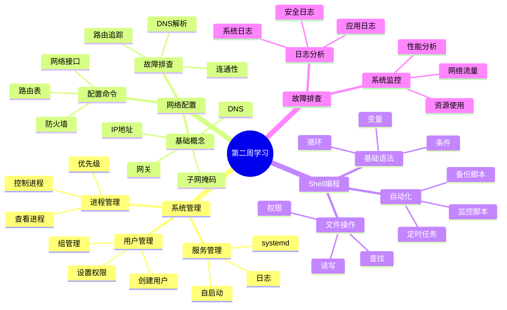
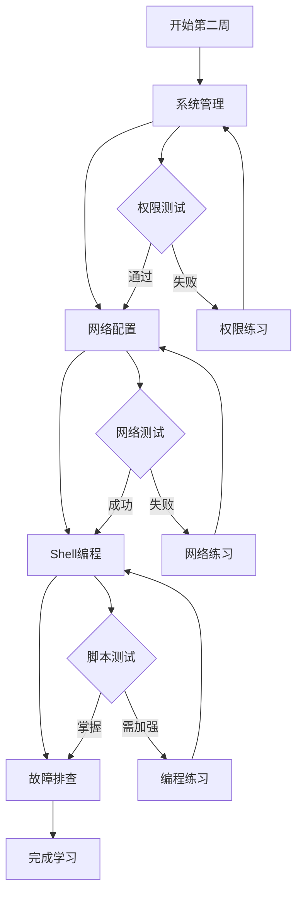

# Linux学习指南 - 第二周：进阶操作和实践 🚀

> 最后更新时间：2025年4月1日
> 
> 版本：1.0.2

## 📋 目录
- [环境配置完成情况](#环境配置完成情况)
- [Day 8-9: 系统管理基础](#day-8-9-系统管理基础)
- [Day 10-11: 网络配置基础](#day-10-11-网络配置基础)
- [Day 12-13: Shell脚本基础](#day-12-13-shell脚本基础)
- [Day 14: 故障排查基础](#day-14-故障排查基础)

## ✅ 环境配置完成情况
### 系统管理检查清单
- [ ] 用户和权限管理已掌握
- [ ] 进程管理命令已熟悉
- [ ] 服务管理配置已完成

### 网络配置检查清单
- [ ] 网络接口已正确配置
- [ ] DNS解析正常工作
- [ ] 防火墙规则已设置

### Shell环境检查清单
- [ ] 基本语法已掌握
- [ ] 脚本权限已正确设置
- [ ] 测试脚本已运行成功

### 故障排查工具检查清单
- [ ] 日志查看工具已安装
- [ ] 系统监控工具已配置
- [ ] 网络诊断工具已准备

## 🗺️ 第二周总体思维导图


## 📈 学习路线流程图


## 🎯 本周学习目标
1. 掌握系统管理基础知识 💻
2. 理解网络配置基本概念 🌐
3. 学习Shell脚本编程基础 📝
4. 掌握基本的故障排查方法 🔍

## 📚 知识要点

### Day 8-9: 系统管理基础 🛠️

#### 1. 用户和权限管理 👥
```bash
# 用户管理基础命令
sudo useradd username    # 创建用户 ➕
sudo passwd username     # 设置密码 🔑
sudo userdel username    # 删除用户 ➖
sudo usermod -aG group username  # 将用户添加到组 👥

# 查看用户信息
id username             # 查看用户ID和组信息 ℹ️
who                     # 查看当前登录用户 👀
w                       # 查看详细的登录信息 📊

# 权限管理
chmod 755 file          # 修改文件权限 🔒
chown user:group file   # 修改文件所有者 👤
chmod u+x script.sh     # 添加执行权限 ▶️

# 高级权限管理
sudo chattr +i file     # 设置文件不可修改 🔒
sudo lsattr file        # 查看文件特殊属性 👁️
```

#### 2. 进程管理 ⚙️
```bash
# 进程查看和控制
ps aux                  # 查看所有进程 📋
top                     # 动态查看进程 📊
htop                    # 更友好的进程查看器 📈
kill -9 PID            # 强制结束进程 ⚡
pkill process_name      # 按名称结束进程 🎯

# 进程优先级管理
nice -n 10 command     # 以较低优先级运行命令 ⬇️
renice -n 5 -p PID     # 调整运行中进程的优先级 ⚖️

# 后台进程管理
command &              # 在后台运行命令 🔄
nohup command &        # 免疫挂起信号运行 💪
screen                 # 终端会话管理器 🖥️
tmux                   # 终端复用器 📺
```

#### 3. 服务管理 🔧
```bash
# systemd服务管理
systemctl start service   # 启动服务 ▶️
systemctl stop service    # 停止服务 ⏹️
systemctl status service  # 查看服务状态 ℹ️
systemctl enable service  # 设置开机启动 🔄
systemctl disable service # 禁用开机启动 ⛔

# 服务日志查看
journalctl -u service    # 查看服务日志 📜
journalctl -f            # 实时查看日志 👀
journalctl --since today # 查看今天的日志 📅
```

### Day 10-11: 网络配置基础 🌐

#### 1. 网络概念 📡
- IP地址：网络中的唯一标识 🏷️
- 子网掩码：定义网络范围 🎭
- 网关：连接不同网络的接口 🚪
- DNS：域名解析服务 📖

#### 2. 网络配置命令 🛠️
```bash
# 网络信息查看
ip addr                 # 查看网络接口 🔍
ip route               # 查看路由表 🗺️
ping domain.com        # 测试网络连通性 📡
netstat -tuln          # 查看网络连接 📊
ss -tuln              # 查看网络连接（新工具）📈

# 网络工具使用
curl url               # 访问网页 🌐
wget url              # 下载文件 ⬇️
ssh user@host         # 远程连接 🔑
scp file user@host:path # 远程复制 📋

# 网络故障排查
traceroute domain.com  # 跟踪网络路由 🔍
mtr domain.com         # 网络质量测试 📊
dig domain.com         # DNS查询工具 🔍
nslookup domain.com    # DNS查询工具 🔎
```

### Day 12-13: Shell脚本基础 📝

#### 1. 脚本编写基础 ✍️
```bash
#!/bin/bash
# 这是一个简单的Shell脚本示例 📝

# 变量定义和使用
name="Linux"           # 定义变量 📌
echo "Hello, $name!"   # 使用变量 💬

# 条件判断
if [ -f "file.txt" ]; then
    echo "文件存在" ✅
else
    echo "文件不存在" ❌
fi

# 循环结构
for i in {1..5}; do
    echo "第 $i 次循环" 🔄
done

# 数组操作
fruits=("苹果" "香蕉" "橙子")
echo "水果数量: ${#fruits[@]}" 🍎
for fruit in "${fruits[@]}"; do
    echo "水果: $fruit"
done
```

#### 2. 常用脚本功能 🛠️
```bash
# 读取用户输入
read -p "请输入名字：" name
echo "你好，$name!" 👋

# 函数定义和使用
hello() {
    echo "Hello, $1!" 👋
}
hello "World"

# 文件操作
while read line; do
    echo "读取的行：$line" 📑
done < file.txt

# 错误处理
if ! command; then
    echo "命令执行失败" ❌
    exit 1
fi
```

### Day 14: 故障排查基础 🔍

#### 1. 日志查看 📜
```bash
# 系统日志
tail -f /var/log/syslog  # 实时查看系统日志 👀
journalctl -xe          # 查看systemd日志 📖
dmesg                   # 查看内核日志 💻

# 应用日志
less /var/log/apache2/error.log  # 查看Apache错误日志 🌐
tail -f /var/log/mysql/error.log # 查看MySQL错误日志 💾

# 日志分析工具
grep -i error /var/log/syslog    # 搜索错误信息 🔍
awk '/error/ {print $0}' logfile # 过滤日志内容 📊
sed -n '/error/p' logfile        # 打印匹配行 📝
```

#### 2. 系统监控 📊
```bash
# 资源监控
top                    # 进程监控 📈
htop                   # 更友好的进程监控 📊
free -h               # 内存使用 💾
df -h                 # 磁盘使用 💿
iostat                # IO状态 💫
sar                   # 系统活动报告 📋

# 网络监控
iftop                 # 网络流量监控 🌐
nethogs               # 进程网络流量监控 📊
tcpdump               # 网络数据包分析 🔍
```

## ✅ 每日练习

### Day 8-9 练习：👨‍💻
1. 创建新用户并设置权限 👥
2. 管理系统进程 ⚙️
3. 配置系统服务 🔧

### Day 10-11 练习：🌐
1. 配置网络接口 🔌
2. 测试网络连接 📡
3. 使用SSH远程连接 🔑

### Day 12-13 练习：📝
1. 编写简单的Shell脚本 ✍️
2. 实现文件批处理功能 📂
3. 创建系统监控脚本 📊

### Day 14 练习：🔍
1. 查看并分析系统日志 📜
2. 监控系统资源使用 📈
3. 排查常见系统问题 🔧

## 📝 学习检查清单

### 系统管理 💻
- [ ] 理解用户和权限概念 👥
- [ ] 掌握进程管理方法 ⚙️
- [ ] 熟悉服务管理命令 🔧

### 网络配置 🌐
- [ ] 理解网络基本概念 📡
- [ ] 掌握网络配置命令 🛠️
- [ ] 能够进行基本的网络测试 🔍

### Shell脚本 📝
- [ ] 掌握脚本编写基础 ✍️
- [ ] 理解变量和流程控制 🔄
- [ ] 能够编写简单脚本 💻

### 故障排查 🔍
- [ ] 熟悉日志查看方法 📜
- [ ] 掌握系统监控命令 📊
- [ ] 能够排查基本问题 🔧

## 📚 扩展阅读
1. Linux系统管理指南 📖
2. Shell脚本编程实战 💻
3. Linux网络配置手册 🌐
4. 系统故障排查手册 🔍

## 🎯 下周预习
1. 高级Shell编程 📝
2. 系统性能优化 ⚡
3. 网络服务配置 🌐
4. 安全加固实践 🔒

## 🌟 进阶提示
1. 尝试使用更多的命令组合来解决复杂问题 🔄
2. 建立自己的命令速查表 📑
3. 多练习编写Shell脚本自动化任务 🤖
4. 模拟各种故障场景并尝试解决 💪

## 🎉 本周小目标
1. 完成用户和权限管理实验 👥
2. 配置基本的网络服务 🌐
3. 编写一个实用的监控脚本 📊
4. 解决一个实际的系统问题 🔧

记住：学习Linux最好的方式就是动手实践！💪

### ❓ 常见问题与解决方案

#### 问题1：用户权限相关
🤔 症状：
- 无法修改系统文件
- Permission denied错误
- sudo命令失败

✅ 解决方法：
1. 检查用户是否在sudo组中
2. 验证文件权限设置
3. 使用sudo -l查看权限
4. 检查/etc/sudoers配置

#### 问题2：网络配置问题
🤔 症状：
- 无法连接网络
- DNS解析失败
- 防火墙阻止访问

✅ 解决方法：
1. 检查网络接口状态
2. 验证IP配置是否正确
3. 测试DNS服务器连通性
4. 检查防火墙规则

#### 问题3：Shell脚本错误
🤔 症状：
- 脚本无法执行
- 语法错误
- 变量未定义

✅ 解决方法：
1. 检查脚本权限
2. 使用bash -x调试脚本
3. 验证变量声明和使用
4. 检查文件路径

### 📝 快速参考卡片

#### 🔑 权限管理速查
```bash
# 文件权限
chmod 755 file         # rwxr-xr-x
chmod u+x file         # 用户添加执行权限
chmod g+w file         # 组添加写权限
chmod o-r file         # 其他移除读权限

# 用户管理
sudo useradd -m user   # 创建用户并建立主目录
sudo usermod -aG sudo user  # 将用户加入sudo组
sudo passwd user       # 设置用户密码
```

#### 🌐 网络配置速查
```bash
# 网络信息
ip addr                # 查看IP地址
ip route show          # 查看路由表
cat /etc/resolv.conf   # 查看DNS配置

# 网络测试
ping -c 4 8.8.8.8     # 测试网络连通性
traceroute google.com  # 路由追踪
nslookup google.com    # DNS查询
```

#### 📝 Shell脚本模板
```bash
#!/bin/bash
# 脚本描述：这是一个基础模板

# 错误时退出
set -e

# 变量定义
LOG_FILE="/var/log/myscript.log"
MAX_RETRIES=3

# 日志函数
log() {
    echo "[$(date '+%Y-%m-%d %H:%M:%S')] $1" >> "$LOG_FILE"
}

# 主函数
main() {
    log "脚本开始执行"
    # 在这里添加你的代码
    log "脚本执行完成"
}

# 执行主函数
main "$@"
```

## 🎯 进阶学习建议
1. 创建个人的Linux学习笔记本 📝
2. 每天练习编写一个小型Shell脚本 💻
3. 搭建测试服务器环境 🖥️
4. 参与开源项目实践 🌟

## 🎉 本周小目标
1. 完成用户和权限管理实验 👥
2. 配置基本的网络服务 🌐
3. 编写一个实用的监控脚本 📊
4. 解决一个实际的系统问题 🔧

记住：学习Linux最好的方式就是动手实践！💪 